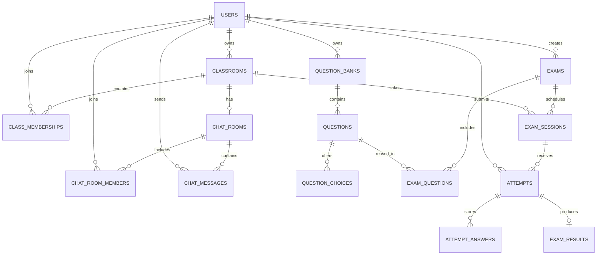

# Cơ sở dữ liệu nghiệp vụ giáo viên

Thiết kế dùng MySQL và mở rộng bảng `users` hiện có. Giáo viên và học sinh đều là tài khoản trong `users`; vai trò được phân biệt bằng `users.role`, không tạo thêm bảng tài khoản trùng lặp.

## Nhóm bảng

### Tài khoản, lớp và thành viên

- `users`: tài khoản chung; `role` xác định `TEACHER`, `STUDENT` hoặc `ADMIN`.
- `classrooms`: lớp và giáo viên sở hữu lớp.
- `class_memberships`: học sinh trong lớp, trạng thái và thời điểm vào/rời.

### Chat lớp

- `chat_rooms`: tối đa một phòng chat cho mỗi lớp (`classroom_id` unique).
- `chat_room_members`: thành viên phòng và thời gian tham gia.
- `chat_messages`: nội dung, người gửi, mã chống gửi trùng và thời điểm sửa/xóa.

### Đề thi và kết quả

- `question_banks`, `questions`, `question_choices`: ngân hàng câu hỏi và lựa chọn. `is_correct` chỉ server/giáo viên có quyền đọc; API học sinh không trả trường này trước thời điểm công bố.
- `exams`, `exam_questions`: đề thi và thứ tự/điểm từng câu. Câu hỏi có thể tái sử dụng giữa các đề.
- `exam_sessions`: lịch mở đề cho một lớp, thời lượng và trạng thái phiên.
- `attempts`, `attempt_answers`, `exam_results`: lượt làm, câu trả lời và điểm do server tính.
- `teacher_audit_logs`: lịch sử thao tác giáo viên để truy vết.

## Quy tắc toàn vẹn

- Mọi bảng nghiệp vụ tham chiếu `users.id`; không xóa vật lý tài khoản/lớp/đề đã được dùng. Dùng trạng thái archive/remove để giữ lịch sử.
- Tạo membership lớp và chat trong cùng transaction. Kiểm tra hết danh sách học sinh trước khi ghi.
- Server xác thực role, quyền sở hữu lớp/đề, membership, thời gian phiên và số lần thi; không tin ID hoặc role do client gửi.
- Khi gỡ học sinh khỏi lớp, thu hồi quyền chat mới nhưng giữ lịch sử. Thành viên mới chỉ đọc tin nhắn từ `joined_at`.
- Điểm và đáp án chuẩn do server xác định. Không trả `question_choices.is_correct` cho client học sinh.
- V2/V3 dùng `CREATE TABLE IF NOT EXISTS` để bootstrap hiện trạng. Thay đổi schema tiếp theo cần migration mới.

## Migrations

- `migrations/V1__create_users.sql`: tài khoản.
- `migrations/V2__teacher_classroom_and_exam.sql`: lớp, thành viên, câu hỏi, đề, phiên thi, bài làm, kết quả và audit.
- `migrations/V3__class_chat.sql`: phòng chat, thành viên chat và tin nhắn.

Server chạy cả ba file khi khởi động từ thư mục `server/`.
